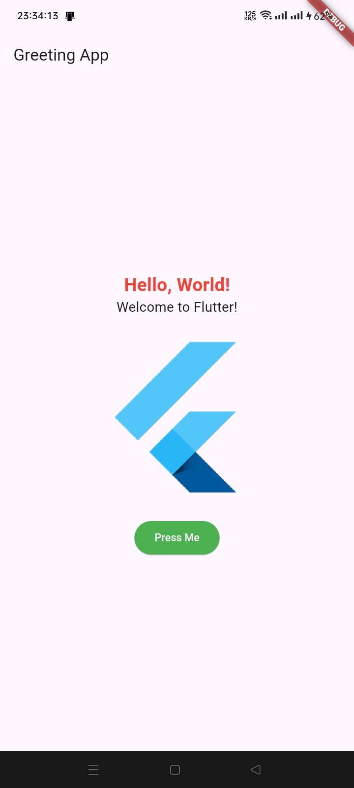
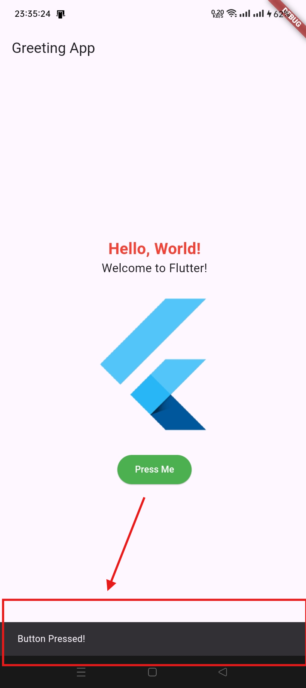

# greeting_app

Assignment - Extend the Greeting App

## Getting Started

This project is a starting point for a Flutter application.

## Features

1. **Display Additional Text:**
    - Below the existing "Hello, World!" text, another `Text` widget displays "Welcome to Flutter!".

2. **Add an Image (Optional):**
    - An image is displayed below the new text. This image can be loaded from a URL or from the project's assets.

3. **Interactive Button:**
    - The button has been modified so that when it is pressed, a `Snackbar` displays the message "Button Pressed!".

4. **Custom Styling:**
    - The text color of the "Hello, World!" message has been changed to red and made bold.
    - The button color has been changed to green.

## Screenshots

### Before Pressing the Button


### After Pressing the Button


## Code

### `main.dart`

```dart
import 'package:flutter/material.dart';

void main() {
  runApp(MyApp());
}

class MyApp extends StatelessWidget {
  @override
  Widget build(BuildContext context) {
    return MaterialApp(
      title: 'Greeting App',
      theme: ThemeData(
        primarySwatch: Colors.blue,
      ),
      home: MyHomePage(),
    );
  }
}

class MyHomePage extends StatelessWidget {
  @override
  Widget build(BuildContext context) {
    return Scaffold(
      appBar: AppBar(
        title: Text('Greeting App'),
      ),
      body: Center(
        child: Column(
          mainAxisAlignment: MainAxisAlignment.center,
          children: <Widget>[
            Text(
              'Hello, World!',
              style: TextStyle(
                color: Colors.red,
                fontWeight: FontWeight.bold,
                fontSize: 24,
              ),
            ),
            Text(
              'Welcome to Flutter!',
              style: TextStyle(
                fontSize: 18,
              ),
            ),
            SizedBox(height: 20),
            Image.network(
              'https://avatars.githubusercontent.com/u/14101776?s=280&v=4',
              height: 200,
            ),
            SizedBox(height: 20),
            ElevatedButton(
              onPressed: () {
                final snackBar = SnackBar(content: Text('Button Pressed!'));
                ScaffoldMessenger.of(context).showSnackBar(snackBar);
              },
              child: Text('Press Me'),
              style: ElevatedButton.styleFrom(
                backgroundColor: Colors.green, foregroundColor: Colors.white,
              ),
            ),
          ],
        ),
      ),
    );
  }
}
